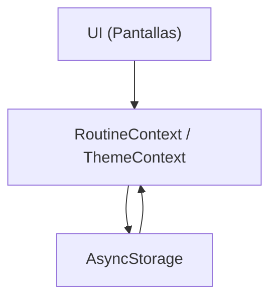

# Rutina Tracker (Expo / React Native)

App mobile para construir rutinas diarias con metas, checklist por dia y calendario de cumplimiento. Proyecto optimizado para produccion con APKs livianos y releases firmados.

APK (placeholder): [Descargar APK]()

**Demo y objetivo**
- App offline-first para seguimiento diario de metas con persistencia local.
- UI cuidada, tipografias coherentes y componentes reutilizables.
- Configuracion de release orientada a APKs pequenos y confiables.

**Stack**
- Expo SDK 55 (managed workflow + EAS)
- React Native 0.83
- React 19
- React Navigation (Bottom Tabs)
- React Native Paper (Material 3)
- AsyncStorage (persistencia local)
- Hermes (JS engine)

**Funcionalidades clave**
- Checklist diaria con progreso y estado de dia completo.
- Calendario con marcas de dias perfectos.
- Metas activas con reordenamiento drag-and-drop persistente.
- Modo claro/oscuro y preferencia guardada en dispositivo.
- Pantallas sin backend, 100% local y privada.

**Pantallas**
- Dia: checklist con progreso, agregar/eliminar metas del dia y estado de lectura para dias pasados.
- Calendario: vista mensual con dias perfectos y detalle del dia seleccionado.
- Metas: listado de metas activas, reordenamiento por arrastre, alta/baja de metas.

**Arquitectura**
- UI: componentes reutilizables en `src/components`.
- Navegacion: tabs en `src/navigation/RootNavigator.tsx`.
- Estado global: `RoutineContext` y `ThemeContext` con `useReducer` y `useMemo`.
- Persistencia: `src/storage/storage.ts` con AsyncStorage.
- Utilidades: `src/utils` para fechas e IDs.
- Theming: `src/theme/theme.ts` con paleta y tipografias.

**Flujo de datos (alto nivel)**


**Estructura del proyecto**
```text
src/
  App.tsx
  components/
  context/
  navigation/
  screens/
  storage/
  theme/
  utils/
assets/
scripts/
android/          (generado por prebuild)
```

**Modelo de datos**
```ts
type Goal = {
  id: string;
  title: string;
  createdOn: DateId;
  deletedOn?: DateId | null;
};

type CompletionsByDate = Record<DateId, string[]>;
```

**Persistencia**
- `rutina_goals_v1` guarda el array de metas (incluye orden).
- `rutina_completions_v1` guarda completados por fecha.
- `rutina_theme_pref_v1` guarda preferencia de tema.

**Reordenamiento de metas**
- Se usa `react-native-draggable-flatlist` en Metas.
- El orden se persiste en el array de metas y se conserva entre sesiones.
- El gesto es "long press" sobre el icono de drag.

**UI y sistema visual**
- Paleta custom con Material 3 y tipografia serif/sans por jerarquia.
- Diologos con radio consistente y superficies suaves.
- Componentes clave: `AppCard`, `EmptyState`, `NoticeBanner`, `ScreenLayout`.

**Scripts**
- `npm run optimize-assets` genera WebP, optimiza PNG y actualiza referencias.
- `npm run subset-fonts` reduce fuentes con `pyftsubset`.
- `npm run clean-install` limpia `node_modules` y reinstala dependencias.
- `npm run build:local:release` build local Android release.
- `python scripts/generate_brand_assets.py` regenera iconos y splash.

**Optimización de release (Android)**
- Hermes habilitado.
- R8 + shrinkResources + Proguard en release.
- `resConfigs` limita locales a `es` y `en`.
- Split por ABI: `armeabi-v7a` y `arm64-v8a`.
- Bundle compression habilitada.

**Build local**
```bash
npm install
npx expo prebuild -p android --clean
npm run build:local:release
```

**Build con EAS**
```bash
eas build -p android --profile release-apk
eas build -p android --profile release-aab
```

**Credenciales y firmado**
- Generar keystore con `keytool` y subir via `eas credentials`.
- No se guardan claves en el repo.

**Permisos**
- Minimos para funcionamiento: `INTERNET` y `VIBRATE`.
- Sin permisos sensibles innecesarios.

**Requisitos**
- Node 18+
- Expo CLI y EAS CLI
- Java 17 (para builds Android)
- Android SDK si haces build local

**Uso rapido**
```bash
npm install
npm run start
```

**Calidad**
- Estado manejado con reducers y memoizacion.
- Persistencia segura con fallback y sin crashes en errores de storage.
- UI consistente y modular.

**Estado del proyecto**
- Sin tests automatizados por ahora.
- Listo para iterar con nuevas metas, recordatorios o sincronizacion remota.

**Construido con ayuda de Codex**
Este proyecto fue iterado con Codex para acelerar arquitectura, UI y optimizacion de release. Resultado: una app profesional y lista para publicarse.

